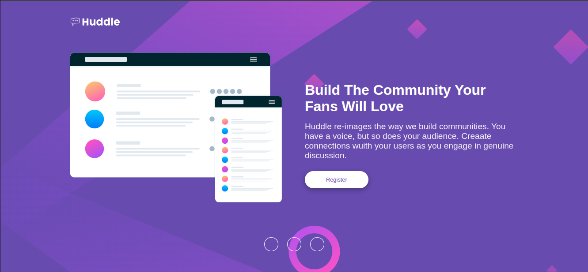

# Frontend Mentor - Huddle landing page with single introductory section solution

This is a solution to the Frontend Mentor challenge "Huddle landing page with a single introductory section".

## Table of contents

- [Overview](#overview)
  - [The challenge](#the-challenge)
  - [Screenshot](#screenshot)
  - [Links](#links)
- [My process](#my-process)
  - [Built with](#built-with)
  - [What I learned](#what-i-learned)
  - [Continued development](#continued-development)
  - [Useful resources](#useful-resources)
- [Author](#author)
- [Acknowledgments](#acknowledgments)

## Overview

### The challenge

Users should be able to:

- View the optimal layout for the page depending on their device's screen size
- See hover states for all interactive elements on the page

### Screenshot

### Links

- Solution URL: [Add solution URL here](https://your-solution-url.com)
- Live Site URL: [Add live site URL here](https://your-live-site-url.com)

## My process

### Built with

- Semantic HTML5 markup
- CSS custom properties
- Flexbox
- CSS Grid
- Mobile-first workflow

### What I learned

- install and use front Awesome to display icons un my challenge
- style my incons with css, adjusting color, backgroud, border radius, and hover effects 

### Continued development

- explore band-specific colors for each social icon (Facebook blue, Twitter light blue, instafram gradient).
- dive into css animations(like subtle zoom or rotation on hover).

- experiment with Google Fonts or other typography options to enhance your design.

### Useful resources

- [Frontend Mentor challenge page](https://www.frontendmentor.io/challenges/huddle-landing-page-with-a-single-introductory-section-B_2Wvxgi0)

## Author

- Your Name
- Frontend Mentor - [@yourusername](https://www.frontendmentor.io/profile/Abidusage)

## Acknowledgments

- Thanks to Frontend Mentor for the project brief.
